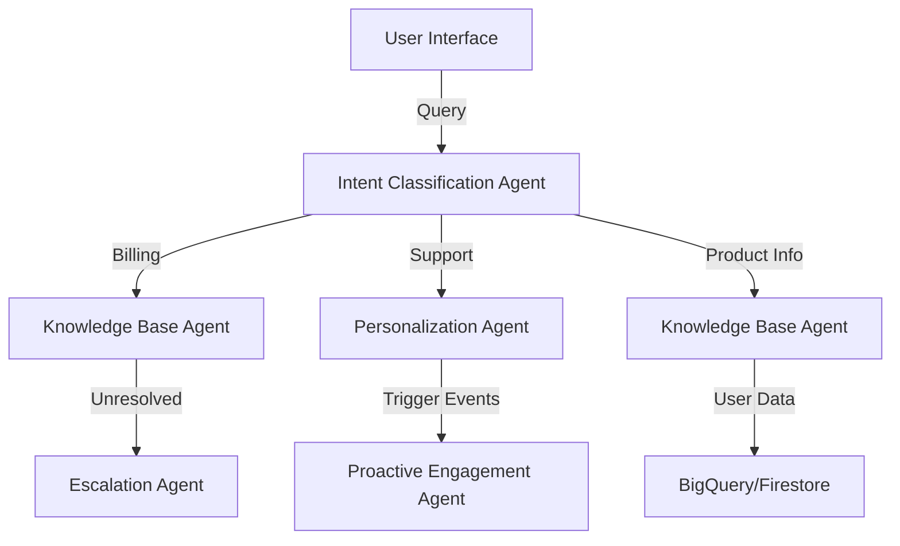

# NeoServe AI - Multi-Agent Customer Service System

NeoServe AI is a cloud-native, multi-agent system built with Google's Agent Development Kit (ADK) that revolutionizes customer service through intelligent automation and personalized interactions.

## Architecture Overview



## Core Components

1. **Intent Classification Agent**: Routes incoming queries to the appropriate handler
2. **Knowledge Base Agent**: Answers FAQs using Vertex AI Search
3. **Personalization Agent**: Tailors responses based on user profiles
4. **Proactive Engagement Agent**: Sends automated follow-ups and tips
5. **Escalation Agent**: Handles case escalation to human agents

## Setup Instructions

1. **Prerequisites**:
   - Python 3.9+
   - Google Cloud SDK
   - Docker (for local development)
   - Node.js 16+ (for frontend)

2. **Install Dependencies**:
   ```bash
   pip install -r requirements.txt
   cd frontend && npm install
   ```

3. **Configure Environment Variables**:
   Copy `.env.example` to `.env` and update with your Google Cloud credentials.

4. **Deploy to Google Cloud Run**:
   ```bash
   gcloud run deploy neoserve-ai --source .
   ```

## Project Structure

```
neoserve_ai/
├── agents/                 # Agent implementations
├── api/                    # FastAPI endpoints
├── config/                 # Configuration files
├── frontend/               # Web interface
│   ├── static/             # Static assets
│   └── templates/          # HTML templates
├── utils/                  # Helper functions
├── main.py                 # Application entry point
└── requirements.txt        # Python dependencies
```

## Development

1. **Local Development**:
   ```bash
   python -m venv venv
   source venv/bin/activate  # On Windows: .\venv\Scripts\activate
   pip install -r requirements-dev.txt
   uvicorn main:app --reload
   ```

2. **Running Tests**:
   ```bash
   pytest tests/
   ```

## Deployment

Deploy to Google Cloud Run:
```bash
gcloud run deploy neoserve-ai --source .
```

## License

Apache 2.0

## Contributing

Please read CONTRIBUTING.md for details on our code of conduct and the process for submitting pull requests.
